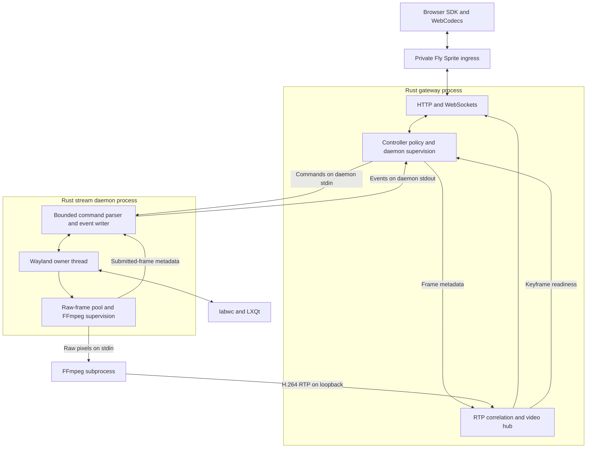

# A private Rust desktop server in this repo

## Request and accepted revision

Build an owned Rust implementation of the Waymote server here, retaining the browser decoder and FFmpeg. Replace the Zig daemon and Go gateway with two Rust executables. Preserve the upstream process responsibilities, daemon IPC and loopback RTP. Use the working Waymote experiment as a reference, without replacing it or the VNC desktops during the port.

Josh approved this revision after reconsidering the security value of separate processes and their use for later OS hardening. It supersedes the earlier single-executable decision. Josh subsequently authorized implementation from the revised outline and directed verification on a Sprite. Both Rust executables and the TypeScript/Effect viewer now run on the private trial; combined failure checks remain incomplete.

The implementation outline is maintained in `002-structure-outline.md` and has been revised for this two-process design. The earlier embedded-library API, media ownership and applied-release acknowledgement assumptions are superseded.

The main decisions are:

1. Two private Cargo packages and executables: `sprite-desktop-streamd` in `crates/streamd/` and `sprite-desktop-gateway` in `crates/gateway/`. Neither links the other's implementation.
2. The gateway owns browser networking, launches the daemon, receives FFmpeg RTP and correlates it with daemon metadata. The daemon owns Wayland access and supervises FFmpeg.
3. Retain the patched reference's version-2 daemon command/event contract, including cursor events, for the supported video-desktop workload. Retain the browser protocol as a separate boundary.
4. Keep the owned TypeScript/Effect viewer in `apps/stream-viewer/`. Preserve current cursor behavior first; laptop-native cursor roles and engagement changes remain separate UX work.
5. Preserve separate address spaces now. Separate service identities and sandbox restrictions are a later hardening task, not a protection claimed by this port.

## What better means

- Josh can read and maintain both server processes in Rust without Go or Zig in the normal build.
- The sources live here, with attribution in README/LICENSE and reproducible reference instructions in the existing probe docs.
- The browser shows a real LXQt/labwc desktop, accepts input, resizes the virtual display, exchanges text clipboard data and reconnects.
- Pointer movement remains local. Text, link, resize and observed hidden-cursor behavior survive the port. Double-click never claims pointer lock automatically.
- A failed private experiment cannot modify the working reference or a VNC desktop.
- Queues, child processes, controller ownership, pipe framing and video resets have explicit behavior and tests. A first-frame smoke test alone does not establish parity.
- Only the gateway exposes browser-facing HTTP/WebSocket endpoints. The daemon does not acquire a second HTTP API or become an embedded gateway library.
- The design leaves a real process boundary for later permission restrictions without claiming those restrictions already exist.

A release, a migration, universal compositor support, independent daemon recovery and a faster video pipeline are not success criteria for this private port.

## Evidence behind the design

Waymote v0.1.2 resolves to commit `90564cfb02030c494939c6fdf29cae9c4d689c67`. Its MIT license permits an attributed derivative implementation. Preserve copyright and license notices for copied or translated code and tests. The root LICENSE now records the applicable upstream notices and their scope without making an unrelated licensing decision for other project code.

The clean reference contains about 9,200 physical lines including comments, blanks, tests, browser code and demo. Runtime source accounts for approximately 2,735 Zig lines, 1,769 Go lines and 2,437 SDK JavaScript lines. Our patch adds roughly 710 net runtime/demo lines and 300 net test lines. These counts exclude generated bindings and dependencies; they describe scope, not effort.

| Source                                                                       | What it establishes                                                                                                                                                                                             |
| ---------------------------------------------------------------------------- | --------------------------------------------------------------------------------------------------------------------------------------------------------------------------------------------------------------- |
| Reference `README.md:84-107`                                                 | The daemon owns sensitive Wayland operations; only the gateway is intended to face the network.                                                                                                                 |
| Reference `gateway/main.go:1156-1182`, `runEncoder`                          | Gateway launches the daemon with pipes, inherited credentials/environment and a process group. The launch path does not establish separate users or a sandbox.                                                  |
| Reference `gateway/main.go`, RTP receiver, video hub and shutdown            | Gateway owns loopback UDP receivers, metadata correlation, keyframe bootstrap and subscriber recovery. Native failure shuts down the gateway; the split does not currently provide independent daemon recovery. |
| Reference `VideoEncoder.zig`, `submit`, `runInner`, `writeFrame`             | Three raw-frame slots, replacement of pending captures, nonblocking FFmpeg writes and child supervision. Metadata follows successful complete-frame submission.                                                 |
| Patched `main.zig`, `submitFrame`, `advanceVideoGeneration`, `waitForDamage` | Capture uses `CLOCK_MONOTONIC`; resize/restart invalidates decoder continuity; damage-driven idle waits until the gateway reports a usable keyframe.                                                            |
| Reference virtual-keyboard and data-control protocol definitions             | These are sensitive desktop capabilities. “Privileged Wayland client” does not establish root execution or Linux capabilities.                                                                                  |
| `probes/waymote/run.sh`                                                      | Known headless labwc/LXQt environment, Breeze theme, startup mode and video targets. Its 0700 runtime directory restricts other users, not processes running as its owner.                                      |
| `probes/compare/waymote.patch`, `CURSORS.md`                                 | Cursor capture, combined image/hotspot/visibility messages, browser behavior and test evidence.                                                                                                                 |
| `probes/view-runtime.ts`, `probes/compare/smoke.ts`                          | Existing credential-isolating browser proxy and limited smoke checks.                                                                                                                                           |
| `apps/viewer/`, `bridge/`, `installer/`                                      | Existing VNC implementation. Do not repurpose these paths or contracts.                                                                                                                                         |

The inspected trees under `/tmp/waymote-cursor-upstream` and `/tmp/waymote-comparison-source` are reconnaissance inputs, not future build dependencies. Pin the source checksum in the existing reference instructions and prepare source in ignored build output when needed.

Rust's client protocol crates cover the needed APIs: [wayland-client](https://docs.rs/wayland-client/latest/wayland_client/), [wayland-protocols](https://docs.rs/wayland-protocols/latest/wayland_protocols/) with client/staging features, [wayland-protocols-wlr](https://docs.rs/wayland-protocols-wlr/latest/wayland_protocols_wlr/), and [wayland-protocols-misc](https://docs.rs/wayland-protocols-misc/latest/wayland_protocols_misc/). This is a Wayland client, not a new compositor.

## Repository organization

| Location                                               | Responsibility                                                                                                                            |
| ------------------------------------------------------ | ----------------------------------------------------------------------------------------------------------------------------------------- |
| `Cargo.toml`, `Cargo.lock`, `rust-toolchain.toml`      | Two-package virtual workspace, committed lockfile, explicit resolver and pinned supported toolchain. Both packages use `publish = false`. |
| `crates/streamd/Cargo.toml`, `src/main.rs`             | Native daemon executable, CLI, startup and shutdown. No browser networking dependencies.                                                  |
| `crates/streamd/src/wayland/`                          | Event-loop owner, capture, input, output, clipboard and cursor implementations.                                                           |
| `crates/streamd/src/video.rs`                          | Raw-frame pool, FFmpeg pipe writing, child supervision and encoder restart state. Split substantial private modules as needed.            |
| `crates/streamd/src/protocol.rs`                       | Bounded stdin command parser and stdout event encoding. Translate records into private native types.                                      |
| `crates/gateway/Cargo.toml`, `src/main.rs`             | Gateway executable, CLI, frontend embedding and startup. No link to the daemon implementation or Wayland libraries.                       |
| `crates/gateway/src/daemon.rs`                         | Daemon process ownership, ordered command writes, stdout event reading, pipe failure and joined cleanup.                                  |
| `crates/gateway/src/http.rs`, `src/protocol.rs`        | HTTP/WebSockets and the browser wire contract.                                                                                            |
| `crates/gateway/src/session.rs`                        | Browser controller ownership and quality-feedback policy.                                                                                 |
| `crates/gateway/src/video/`                            | RTP reconstruction, capture-metadata correlation, GOP bootstrap, generation handling and bounded subscribers.                             |
| `crates/gateway/src/cursor.rs`                         | Cursor event validation, premultiplied pixel conversion, PNG encoding and latest controller state.                                        |
| Tests beside private modules                           | Deterministic command/event, packet, state, queue and lifecycle tests.                                                                    |
| Process-level tests and attributed fixtures            | Exact IPC/browser bytes, pipe backpressure, child exits and paired-binary integration. Do not expose internals solely for tests.          |
| `apps/stream-viewer/`                                  | Owned patched SDK, tests, worklet asset and a small Vite/TypeScript app with Effect-owned lifetimes.                                      |
| `README.md`, `LICENSE`                                 | Attribution and retained notices. No `third_party/` directory.                                                                            |
| `probes/waymote/README.md`, `probes/compare/README.md` | Reference revision, checksum and reconstruction instructions. No provenance package or manifest.                                          |
| `target/waymote-reference/`                            | Ignored reference source/build cache.                                                                                                     |
| `probes/rust-desktop/`                                 | Isolated launcher/service, native/browser checks and run evidence.                                                                        |

These are responsibility locations, not instructions to create empty scaffolding. Capture, input, encoder and RTP stay as private modules rather than additional crates. Each executable owns its side of the IPC encoding/decoding. Use a documented wire contract, golden fixtures and cross-process tests to keep the two ends consistent; do not add a shared runtime dependency or a bag of shared types.

Copy retained browser source and selected fixtures before making targeted edits. Preserve their notices and original paths. Reference reconstruction applies the saved patch and copies `recorder.mjs` and `metrics.mjs` separately, as the existing experiment requires. Normal builds do not rebuild the old Go/Zig binaries.

Build the viewer before embedding its assets in the gateway. Keep frontend orchestration outside Cargo build scripts. Missing assets fail clearly. Build and install the two Rust executables as a matched pair with identifiable versions; do not add runtime negotiation or a Go/Zig fallback. The existing release/install commands remain unchanged.

## Runtime and ownership

The service launcher starts labwc/LXQt and the gateway under a desktop D-Bus session. The gateway launches the stream daemon. The daemon launches FFmpeg. Only the gateway binds browser-facing endpoints; it also binds the loopback RTP receiver before starting the daemon. The daemon connects to Wayland and has no HTTP listener.

Both binaries may use threads and async I/O internally. A single owner thread holds the Wayland proxies, registry/event queue, SHM buffers and native input state. A calloop event loop with its Wayland adapter is a candidate. Tokio/Axum remain reasonable gateway choices. Pin and verify dependency versions during implementation.

### Daemon IPC is a real boundary

Keep the patched reference's version-2 protocol for the supported workload:

- Gateway-to-daemon stdin carries the existing fixed command headers and bounded variable clipboard/text payloads, including release-all, resize, quality and keyframe-readiness commands.
- Daemon-to-gateway stdout carries the 8-byte event header and clipboard, frame-metadata, resize-applied, cursor-image and cursor-visibility payloads. Cursor images retain the current BGRA/alpha semantics and bounds.
- FFmpeg sends H.264 RTP to the gateway's loopback receiver. Do not also support raw H.264 on daemon stdout; stdout belongs to events in this port.

The gateway parses and validates browser input, then emits daemon records. The daemon independently validates its own framing, sizes, reserved fields and semantic bounds before touching Wayland. These checks protect different boundaries; the daemon must not assume a gateway is trustworthy because the gateway normally validates requests. The gateway likewise bounds and validates daemon events and RTP.

Reads and writes may split records. EOF halfway through a record is failure, not an empty event or permission to resynchronize by guessing. Give stdout a single event writer and keep logs on stderr. Bound counts and bytes on both sides, including queued metadata, cursor images and clipboard transfers. Required metadata cannot be dropped like replaceable cursor state.

Each process uses its own small internal types. Serialize only at IPC/browser boundaries. No generic backend trait, shared-memory handle exchange or cross-process Rust object API is needed.

### Input ownership and handoff

The gateway owns the browser controller lease and rejects stale work from prior owners before serializing it. It uses one ordered command writer. Release-all must precede every input record from a new controller, and the daemon applies those records in order. Never drop a key-up or release-all silently.

The retained IPC has no dedicated release-applied acknowledgement. Completing a pipe write is not evidence that the compositor has processed it. Preserve the ordered handoff contract instead of carrying over the superseded library design's awaited native-release API. Browser `active` reports controller ownership, not physical completion of input. Frame metadata continues to report the latest actually applied input sequence.

A full queue cannot justify granting another controller before its release boundary is ordered. Use a bounded failure path: revoke browser control and shut down the unhealthy daemon/session if delivery cannot progress. On stdin EOF or orderly shutdown, the daemon releases held input and closes native resources. Test abrupt process death as well; do not assume graceful cleanup ran after a kill.

### Media, time and recovery

Preserve 60 FPS/8 Mbps startup targets, the SDK's 60 ms latency selection, existing encoder flags and adaptive-quality behavior. Do not combine the port with codec, bitrate or buffering experiments.

The daemon owns captured SHM. Copy completed pixels into an owned encoder slot before allowing compositor reuse. Preserve the three-slot pool and latest-pending replacement. FFmpeg writes must not block Wayland dispatch. A partially submitted raw frame cannot be followed by another frame in the same child after abandoning the remaining bytes.

Only a frame fully submitted to FFmpeg produces capture metadata. A replaced pending capture produces none. The gateway correlates that metadata with RTP from the corresponding encoder generation, including timestamp-gap behavior. Handle metadata/RTP arrival races with bounded queues; never invent pairings after loss or overflow.

Capture-ready timestamps in the daemon and pong timestamps in the gateway use the same host `CLOCK_MONOTONIC` domain. Do not mix wall time, arbitrary `Instant` origins or encoder completion time into this contract.

The daemon manages encoder restarts and output changes. The gateway clears stale bootstrap/subscriber state and reports keyframe readiness through the retained command. Preserve that handshake: damage-driven idle must not begin before the current generation has a usable keyframe. Output acceptance and presentation at the new size are distinct events.

The gateway owns bounded GOP bootstrap and per-viewer queues. Slow viewers recover at a keyframe without stalling capture or retaining unlimited data. An idle desktop must deliver its first and final changed frame without requiring later damage.

Use the accepted 3840×2160 raw-pixel budget within the existing dimension envelope. Validate dimensions, stride and allocation arithmetic at their respective boundaries. High-resolution support does not promise 60 delivered FPS.

The gateway owns daemon supervision; the daemon owns FFmpeg supervision. On shutdown, stop admission, revoke input, close/drain pipes as appropriate, stop and reap owned children, and join readers/writers. Preserve whole-session failure on fatal daemon exit for this port rather than adding independent worker recovery. Test gateway failure, daemon failure, FFmpeg restart, pipe EOF/backpressure and absence of orphaned FFmpeg children.

`/healthz` reads maintained session readiness. Native failure or a broken required pipe must not leave the gateway apparently healthy. Ordinary idle capture remains healthy without HTTP probes creating desktop activity.

## Security decision and later hardening

### What the process split provides now

HTTP/WebSocket parsing and the connected Wayland client occupy separate address spaces. Gateway code cannot reach native pointers or mapped buffers through ordinary in-process memory access. This is a concrete separation that Rust crate privacy alone cannot preserve.

“Privileged Wayland client” describes sensitive compositor capabilities. It does not prove root execution or special Linux capability grants. The inspected upstream launch path inherits credentials and environment and does not configure a separate user, sandbox or privilege drop. The private Sprite launcher also does not establish a less-privileged gateway.

Do not describe the two-process port as a sandbox or an enforced least-privilege deployment. Same-user access, process-inspection permissions and the powerful commands deliberately exposed by the daemon limit the protection. A compromised gateway can still abuse permitted keyboard, clipboard and capture requests even after stronger isolation is added.

### Why retain it for this port

The earlier single-executable design reduced IPC and process coordination. That remains a real implementation benefit, but Josh chose to preserve address-space separation and the option to enforce permissions later. Two Rust executables retain the working architecture and avoid having to split an embedded runtime apart when hardening is undertaken.

Moving the RTP receiver and video hub into an embedded desktop library is therefore superseded. Preserve their upstream gateway ownership and the existing metadata/keyframe handshake.

### Deferred OS hardening

A later task can establish separate service identities, restrict gateway access to the Wayland socket and desktop files, constrain inherited descriptors/process access, and sandbox each process around its actual operations. That task must design launcher privileges, IPC ownership and any namespace/network restrictions deliberately. Removing environment variables alone does not revoke socket access.

The current gateway-launches-daemon lifecycle is not guaranteed to remain suitable after privilege separation. A trusted launcher may need to create channels and start both identities, or privileges may need to be dropped in a controlled order. Loopback RTP and the common monotonic clock domain also need explicit treatment if namespaces change.

Do not add speculative sandbox flags, service accounts or compatibility launch modes during the language port. Keep the protocol narrow and bounded now, and leave enforcement to a separately verified hardening change.

## Browser boundary and private access

Keep `/stream`, `/control`, `/healthz` and viewer assets in the gateway. Audio is disabled; `/audio` is not implemented. Do not expose the daemon IPC as an HTTP/WebSocket route. Do not add `/vnc`, alternate JSON shapes, version negotiation or a Go bridge fallback.

Preserve the browser's 40-byte video header and its sequence, timestamp, generation, dimension and reset semantics. Browser control includes its supported binary records, literal acquire/release strings and JSON messages. Daemon command types are not automatically valid browser commands.

Preserve absolute/relative pointer input, keys/modifiers/repeat, text composition, text clipboard, responsive sizing, controller acquire/release, quality feedback, reconnect bootstrap and current cursor messages. Browser scheduling and stale-connection guards remain unchanged. Use the existing recorder through an opt-in import rather than creating another implementation.

Fly remains the TLS/authentication boundary: `auth: sprite`, `private_access: admins`. The gateway also checks the exact configured canonical Origin before upgrade, including duplicate, missing, null and foreign Origin cases. Credentials stay out of assets, URLs, recordings and logs. The loopback-only test proxy strips credential-bearing cookies on HTTP and WebSocket responses.

## Retained scope decisions

### Attribution and source ownership

Keep attribution in README/LICENSE and notices in copied files. Keep reference details in existing probe documentation. No `third_party/`, vendored reference tree or separate provenance manifest is needed. `apps/viewer/` and `bridge/` remain VNC; active Waymote-derived browser source is ordinary source in `apps/stream-viewer/`.

### Cursor parity before native appearance

Preserve current image/hotspot/visibility behavior, fresh-seat startup ordering, SHM bounds, deduplication and explicit capture failures. Keep the selected Breeze theme, normal output transform and current supported cursor buffer format. The gateway converts daemon pixels into the existing browser PNG messages and restores cached state on controller attachment.

The cursor capture protocol supplies pixels, hotspot and enter/leave/position events, not another application's text/link/resize role. Enter/leave is not proof of every application's hiding behavior. Do not replace shapes with a generic arrow, add speculative image classification or claim the Rust port solves laptop-native appearance.

Retain explicit control acquisition and manual pointer lock for parity. Do not grant background-tab input or add automatic pointer lock to hide the engagement click.

### Supported workload, not full upstream parity

Include video, input, composition, clipboard, resize, adaptive quality, reconnect and cursor behavior. Retain browser audio code/worklet if that avoids unrelated SDK churn, but instantiate `audio: false`, expose no audio control and verify no audio socket opens. Do not implement daemon/gateway audio or Opus transport in this port.

No hardware encoding, DMA-BUF capture, multiple monitors, arbitrary compositor support, plugin system, generic media framework, Rust/Wasm browser rewrite, codec implementation or VNC release work.

## Work and verification to carry into the revised outline

Rework the implementation slices around the real process boundary:

- Own the browser, record attribution and establish both binary packages and their wire fixtures.
- Test real FFmpeg submission in the daemon and RTP/metadata correlation in the gateway, including the pipe/keyframe handshake before claiming full media parity.
- Deliver real Wayland frames through the paired Rust processes and retained browser.
- Port controller ordering, keyboard/pointer/text, clipboard and resize across IPC.
- Port native cursor capture, stdout cursor events and gateway/browser image state.
- Verify combined lifecycle, IPC backpressure and a short comparison on the isolated Sprite.

Put pure tests beside private modules. Use attributed golden command/event/browser fixtures and real pipe/process tests. The upstream `TestRTPAssemblerEmitsAccessUnitAtMarkerWithoutNextFrame` remains a concrete idle-final-frame reference.

Required cases include fragmented/truncated/oversized records, EOF, malformed daemon output, invalid browser messages, bounded queues, raw-frame replacement, partial FFmpeg writes, RTP loss/wrap, missing metadata, generation changes, keyframe readiness, slow viewers, cursor alpha/state, controller handoff and child cleanup. Never treat a successful pipe write as an applied-input acknowledgement.

Existing checks remain useful: `node --test probes/compare/metrics.test.mjs`, `pnpm exec tsc -p probes/tsconfig.json`, `shellcheck probes/waymote/run.sh`, patched SDK tests, and the separate Go/Zig reference suites.

Verification commands from the design. Consult the trial README for current results:

- `pnpm --filter @sprite-desktop/stream-viewer test` and `build`.
- `cargo test -p sprite-desktop-streamd` without viewer assets or gateway dependencies, subject to native build prerequisites.
- `cargo test -p sprite-desktop-gateway` after embedding assets, without linking Wayland libraries. Pure gateway checks must not require a running native daemon.
- `cargo fmt --all -- --check`, `cargo clippy --workspace --all-targets -- -D warnings`, `cargo test --workspace`, and `cargo build --release --workspace` for the matched pair.
- Explicit real-FFmpeg, paired-process and isolated native/browser suites. Missing prerequisites or skipped required cases are not passing native evidence.

Use native cua-driver snapshots to establish desktop fixture state. Use agent-browser for the viewer, connection controls, resize and browser assertions. Native input alone does not prove browser delivery; synthetic browser events alone do not prove app response. Keep Josh's short real-browser input/feel check separate from automated counters. Do not require another performance campaign or infer physical input latency from frame timing.

## Isolation and stopping points

Use a new disposable `sprite-desktop-rust` only after implementation/deployment authorization. Require private/admin access. Preserve `sprite-desktop-waymote` as the working reference. Do not modify `josh-desktop`, `sprite-desktop-v1`, the comparison VNC service or installer ownership records.

The trial launcher derives from `probes/waymote/run.sh`, with paths to the paired Rust executables. Launch the gateway and configure its daemon path explicitly. Do not adapt the VNC installer. Compositor readiness must refer to the process actually launched rather than a stale socket.

Stop for review if the retained contract cannot support required behavior, media correlation cannot be made correct, cursor roles require compositor changes, or deployment would change authentication or a protected Sprite. Describe evidence before adding a protocol extension, alternate transport, privilege mechanism or migration.

The relevant coding-standards concerns are boundaries, state/ownership and observable failure. Keep native dependency types inside their process, validate each external boundary and distinguish actual security enforcement from architectural intent.

## Next artifact

The two-process revision was accepted and implemented from `002-structure-outline.md`, without a separate executor plan. The authorized `sprite-desktop-rust` trial now runs both Rust binaries. The trial README records live checks and the combined failure cases still outstanding. Existing VNC and Waymote desktops remain unchanged.
